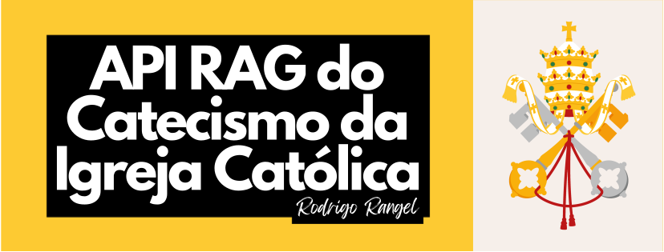

<h1><p align="center"><b>API RAG do Catecismo da Igreja Católica</b></p></h1> 

<p align="center"><a href="https://catholic-catechism-rag-api.aight.com.br/"></a></p> 

> **Status**: *Em desenvolvimento ⚙️*

<h2 align="center"><p><a href="https://catholic-catechism-rag-api.aight.com.br/"><u>Clique aqui para chamar a API pública!</u></a></p></h2> 

<div style="margin: 40px;"></div>

# Objetivos do Projeto
A **API RAG do Catecismo da Igreja Católica** nasceu de uma vontade simples: usar o meu conhecimento em **Engenharia de IA** para <u>ajudar a espalhar a evangelização católica a todos</u>. A ideia central do projeto é começar a criar um curadoria de conteúdos textuais da Igreja Católica que possam servir aplicações digitais, em principal, chatbots, usando a técnica **RAG** (Retrieval-Augmented Generation) que permite melhorar o contexto da solicitação do usuário com base nas informações obtidas através desta API.

Até o momento, API expõe um endpoint dedicado, capaz de receber perguntas catequéticas, validar sua adequação e devolver os parágrafos mais relevantes do Catecismo com localização completa e transparência doutrinal.

A partir desse propósito, o projeto também virou um laboratório onde aprendo, treino e aplico conceitos de desenvolvimento importantes como: <u>mineração de dados, embeddigns de dados, armazenamento de dados e consumo em banco de dados vetoriais, boas práticas de arquitetura de software e codificação, modelagem de sistemas e deploy de aplicações</u>. Por esse projeto ter se tornado esse laboratório de aprendizagem, desenvolvi também uma aplicação de chatbot que usa essa API para demonstrar um caso de uso válido: o [**AmicusDei**](https://amicusdei.streamlit.app/), um assistente teológico criado para responder dúvidas sobre a Doutrina e a Fé da Igreja Católica, com base direta no Catecismo da Igreja Católica (CIC).

<div style="margin: 20px;"></div>

# Arquitetura e Fluxo da API
1. **Validação pastoral das requisições**

    Cada chamada ao `POST /hybrid_search` passa pela classe `QueryValidator`, que combina moderação automática (`omni-moderation-latest`) e um prompt dedicado na OpenAI. Consultas fora do contexto catequético ou inadequadas retornam mensagens pastorais via `ValidationDomainError` e `handle_errors`.

2. **Ingestão e curadoria do Catecismo**

    O pipeline `ingest_catechism_paragraphs.py` rastreia o site do Vaticano, organiza partes/seções/capítulos/artigos e gera payloads estruturados. O `CatechismParagraphsIngestor` cria embeddings, monta `PointStructs` e persiste tudo no Qdrant.

3. **Busca híbrida Fastembed + Qdrant**

    O `FastembedHybridEmbedder` gera vetores densos, representações BM25 e matrizes de late interaction, inicializados no lifespan do FastAPI. O `QdrantVectorDBRepository` e suas factories cuidam da coleção e da busca híbrida, retornando até `top_k` parágrafos com `similarity_score` e metadados completos.

4. **Orquestração e resposta HTTP**

    O `CatholicCatechismSeacherController` calcula `took_ms`, decide entre respostas `200` (sucesso) e `406` (ask_clarifying) e empacota tudo no `HttpResponse`. Em falhas de domínio ou infraestrutura, o `handle_errors` garante mensagens consistentes para quem consome a API.

## Como utilizar?
<p align="center">
  
</p>

<div style="margin: 20px;"></div>

# Estrutura de Pastas do Projeto
```
catholic_catechism_rag_api/
├── run.py                              # Inicialização do uvicorn (FastAPI sem reload)
├── Dockerfile                          # Empacotamento para deploy
├── requirements.txt                    # Dependências (FastAPI, Fastembed, Qdrant, OpenAI etc.)
├── src/
│   ├── config/logger_config.py         # Setup centralizado de logging
│   ├── domain/                         # Serviços (scraper, validator) e casos de uso do RAG
│   ├── errors/                         # Tipagens e handlers de exceção
│   ├── infra/
│   │   ├── fastembed_embedder/         # Embedders híbridos e factories
│   │   ├── openai_api/                 # Conexão AsyncOpenAI e builders de prompts
│   │   └── vector_db/qdrant/           # Repositório, factories e settings do Qdrant
│   ├── main/
│   │   ├── server/                     # Instância FastAPI, descrição e lifespan
│   │   ├── routes/                     # Endpoints HTTP (ex.: /hybrid_search)
│   │   ├── composers/                  # Wire-up das dependências para cada caso de uso
│   │   └── pipelines/                  # Scripts de ingestão do Catecismo
│   ├── presentation/                   # Controllers e contratos HTTP
│   └── validators/                     # Modelos Pydantic usados em toda a aplicação
└── LICENSE                             # MIT License
```

<div style="margin: 20px;"></div>

# Próximos Passos
- Desenvolver busca de parágrafos do CIC mais similares a conjunto de  palavras chaves definidas pelo usuário; 
- Expandir o dataset com novas traduções do CIC (EN/ES) e permitir queries multilíngues;
- Mover banco de dados vetorial Qdrant para servidor que hospeda a aplicação, visando diminuir a latência das respostas.
- Criar testes end-to-end simulando requisições reais, cobrindo casos 200, 406 e 422;
- Realizar mineração de dados e embedding do ~Código do Direito Canônico.

<div style="margin: 20px;"></div>

# Referências
CATECISMO DA IGREJA CATÓLICA. Edição típica vaticana. Disponível em: https://www.vatican.va/archive/cathechism_po/index_new/prima-pagina-cic_po.html

OPENAI. Documentation. Disponível em: https://platform.openai.com/docs/.

QDRANT. Documentation. Disponível em: https://qdrant.tech/documentation/.

FASTAPI. Documentation. Disponível em: https://fastapi.tiangolo.com/.

<hr></hr>
<div style="margin: 20px;"></div> 

<p align="center">Para acompanhar evoluções do projeto, siga as atualizações neste repositório.</p> <p align="center">Que Deus te abençoe! 🙏</p>